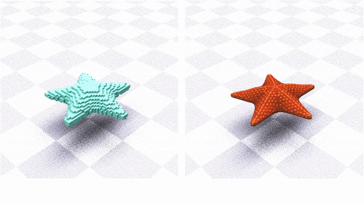

# Shape Targeting Simulation

This is an unofficial implementation of the paper 
[Learning active quasistatic physics-based models from data](https://pages.cs.wisc.edu/~qisiw/SIG.html) by Srinivasan et al, Siggraph 2021.

 

## 1. Overview
The pipeline of the paper includes two modules, an autoencoder and a quasistatic differentiable softbody simulator. The simulator is integrated as the final layer into the netowork. 

### 1.1 Solver
The solver formulation is from a subsequent paper [Implicit Neural Representation for Physics-driven Actuated Soft Bodies](https://studios.disneyresearch.com/app/uploads/2022/07/Implicit_Neural_Representation_for_Physics-driven_Actuated_Soft_Bodies_final-1.pdf) by Yang et al, Siggraph 2022. The paper derived an explicity formulation of the differentiation of shape targeting, which is more favorable than the iterative solution proposed in the original paper. 

The solver code is adapted from [Differentiable projective dynamics](https://github.com/mit-gfx/diff_pd_public), which provided an excellent framework for general differentiable projective dynamics simulations.

### 1.2 Comparing to original papers
> What this repo implemented
* Core solver's forward and backward pass using shape targeting
* Attaching 'zero-rest-length' springs as initialization mentioned in Sec 5.1.
Which you will find in `python/example/utility_starfish.ipynb`
* support for dirichlet boundaries, useful for regions closesly related to bone movements.
* numerical checks for the solver

> What is different, but still works
* Used hexadralization instead of tetrahedralization, conforming to Yang et al. 2022
* The repo didin't construct the hexahedrals from BCC lattices. But directly gnerated a voxelized mesh then find the correspondance by shortest distance between trimesh vertices and hexa volume centers. Will update to lattice method in the future.

> What is missing
* Paper used mutliple simulation instance during training to speed up (when you have a batch size of 8, you will need 8 instances to handle simulation). I don't have any clues on how to implement that on a single computer with the diffpd architecture. Any hints are welcome.
* Yang et al added a bunch of little networks to the pipeline in order to support multi-resolution, identity transfer, etc. Here we only have the core network.
* Mandible tracking.
* Collision handling. While it is absolutely doable with diffpd (and have been done by the same research group [recently](https://studios.disneyresearch.com/app/uploads/2023/11/An-Implicit-Physical-Face-Model-Driven-by-Expression-and-Style-Paper.pdf))

## 2. Data
Yang et al used a starfish example directly generated from diffpd, which I couldn't produce for some reasons. Therefore I purchased rather cheap starfish animation sequence from sketchfab [(link)](https://sketchfab.com/3d-models/lowpoly-starfish-43c0d848da2d43d8a145046d12bf63b4) as the drop-in replacement.

## 3. Installation
Please refer to diff-pd installation guide [here](https://github.com/mit-gfx/diff_pd_public/tree/master)

## 4. How to Run
To get the simulation running properly, you need to obtain these
1. A sequence of soft body simulation that contains vertices positions.
2. From the given sequence, pick a rest pose, voxelize or tetrahedralize it, obtain the simulation mesh. 
3. Construct a barycentric or trilinear mapping between tri-mesh and simulation mesh.

For 2 and 3 You may find utility_starfish.ipynb helpful.

### 4.1 Simulation Demo
After installing all components and obtaining a decent dataset, you can change the paths in `quasi_starfish.py` under `./python/example`. By the default the script will run the forward and backward simulation (no VAEs) and try to optimize the shape target muscle actuation matrices.

### 4.2 Full pipeline
You may find vae_train_with_sim.py and similar scripts that integrate the simulation layer into VAEs. Usage should be straighforward after you familarize yourself with simulatoin

## 5. Code structure
All solver code is in `cpp/`. I directly hardcode shape targeting into `Deformable` class, since none of the existing `energy` class can be easily expanded to accomodate the new formulation. The main components are in
* `deformable_shape_targeting_backward.cpp`
* `deformable_shape_targeting_forward.cpp`

and I added pretty extensive gradient check in `deformable_shape_target_gradient_check.cpp`
which maybe called during backward pass for sanity check.